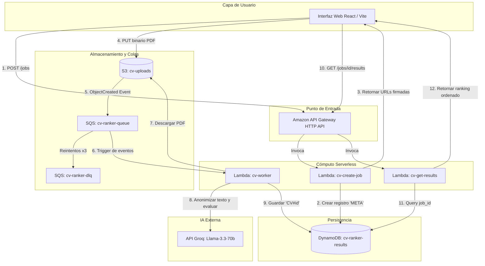

# CV Ranker Backend 🚀

Backend serverless e interactivo basado en eventos para evaluar Currículums Vitae (CVs) en formato PDF contra los requisitos de una oferta de empleo. Utiliza Amazon S3, Amazon SQS, AWS Lambda, Amazon DynamoDB y la API de Groq (Llama-3.3-70b).

Este repositorio está adaptado para ser desplegado de forma segura en **AWS Academy Learner Labs** utilizando el rol de ejecución pre-creado `LabRole`.

---

## 📄 Contexto de la Problemática e Impacto (Rúbrica - Criterio 1)

### 1. La Problemática
En los procesos de selección masivos, los departamentos de Recursos Humanos se ven inundados por cientos de currículums para una sola vacante. El filtrado manual inicial ("screening") consume valiosas horas de trabajo, es propenso a errores por cansancio cognitivo y se ve afectado por sesgos inconscientes (género, edad, nacionalidad, universidad de egreso, etc.). En promedio, un reclutador pasa solo 7 segundos leyendo un CV antes de descartarlo, lo que incrementa el riesgo de dejar pasar talento calificado.

### 2. Casos de Uso de la Solución
* **Filtro Masivo Asíncrono:** El reclutador define los requisitos del puesto (título, habilidades clave, años de experiencia) y sube en lote de 20 a 30 CVs en formato PDF. El sistema procesa todos los archivos de manera paralela e independiente.
* **Reclutamiento Ciego y Anonimización (Privacidad por Diseño):** Antes de enviar el contenido del CV al modelo de lenguaje (LLM), el backend detecta y remueve automáticamente datos de contacto sensibles (correos electrónicos, enlaces de LinkedIn, teléfonos). Esto protege la privacidad del postulante y mitiga el sesgo inconsciente en la evaluación.
* **Análisis Estructurado de Brechas (Gap Analysis):** La Inteligencia Artificial analiza el CV y genera un informe estructurado que resalta de forma objetiva las **fortalezas** del candidato, las **brechas de habilidades (gaps)** respecto a la vacante, estima su nivel de **seniority** y calcula un **score numérico objetivo de coincidencia (0-100)**.

### 3. Impacto Esperado
* **Reducción de Tiempo del 90%:** El tiempo de filtrado inicial pasa de tomar horas o días a completarse en pocos minutos de forma asíncrona.
* **Evaluación Objetiva y Estandarizada:** Cada candidato es medido exactamente con los mismos parámetros lógicos del LLM, eliminando la subjetividad.
* **Ahorro de Costos de Cómputo (Serverless):** La infraestructura no requiere servidores encendidos 24/7; escala a cero cuando no se están evaluando CVs, reduciendo los costos operativos de nube a casi cero.

---

## 📐 Diagrama de Arquitectura de Solución (Rúbrica - Criterio 2)

A continuación se detalla el flujo de datos y eventos en la infraestructura serverless de AWS:



---

## 🛡️ Resiliencia y Manejo de Límites de la API (Rúbrica - Criterio 3)

El backend implementa mecanismos de tolerancia a fallos para proteger la interacción con el LLM:
* **Desacoplamiento mediante SQS:** La subida de los archivos a S3 no bloquea al usuario. S3 notifica los eventos a SQS y la Lambda los procesa de forma asíncrona en lotes pequeños (`BatchSize: 5`), controlando el flujo de solicitudes concurrentes hacia la API de Groq.
* **Políticas de Reintento Automático:** El worker captura errores transitorios de la API de Groq (HTTP 429 por Rate Limits o HTTP 5xx por problemas del servidor) y relanza la excepción. Esto provoca que Amazon SQS reencole automáticamente el mensaje tras un tiempo de espera controlado (`VisibilityTimeout: 360` segundos en la cola vs `Timeout: 60` segundos en la Lambda).
* **Manejo de Errores Críticos:** Si ocurre un error de sintaxis del LLM o una petición no-reintentable (HTTP 400), el worker registra el estado del CV como `failed` en DynamoDB para notificar al usuario y consume el mensaje de SQS para evitar bloqueos infinitos de la cola.
* **Dead Letter Queue (DLQ):** Si un mensaje de CV falla más de 3 veces consecutivas, se transfiere automáticamente a `cv-ranker-dlq` para su posterior auditoría, previniendo la pérdida definitiva de datos.

---

## 🔌 API Contract (Para el Desarrollador Frontend)

### 1. Crear un Trabajo de Evaluación
* **Endpoint:** `POST /jobs`
* **Content-Type:** `application/json`
* **Cuerpo de la Petición:**
  ```json
  {
    "job_title": "Backend Python Developer (AWS)",
    "required_skills": ["Python", "AWS", "DynamoDB"],
    "years_experience": 5,
    "cv_count": 2
  }
  ```
* **Respuesta (201 Created):**
  ```json
  {
    "job_id": "c171ed99c44a33d5f20932c13f477fc0",
    "upload_urls": [
      {
        "cv_id": "93fd4530fa70c5ddcfc8c88e7d442ae5",
        "presigned_url": "https://cv-uploads-12345.s3.amazonaws.com/jobs/c171ed99c44a33d5f20932c13f477fc0/cvs/93fd4530fa70c5ddcfc8c88e7d442ae5.pdf?AWSAccessKeyId=...",
        "s3_key": "jobs/c171ed99c44a33d5f20932c13f477fc0/cvs/93fd4530fa70c5ddcfc8c88e7d442ae5.pdf"
      },
      {
        "cv_id": "38ed1c57565d57eaa24312e4dba07702",
        "presigned_url": "https://cv-uploads-12345.s3.amazonaws.com/jobs/c171ed99c44a33d5f20932c13f477fc0/cvs/38ed1c57565d57eaa24312e4dba07702.pdf?AWSAccessKeyId=...",
        "s3_key": "jobs/c171ed99c44a33d5f20932c13f477fc0/cvs/38ed1c57565d57eaa24312e4dba07702.pdf"
      }
    ],
    "expires_in_seconds": 900
  }
  ```

> [!IMPORTANT]
> **Subida a S3 desde el Frontend:**
> Para cada archivo PDF seleccionado, el frontend debe realizar una petición HTTP **`PUT`** directamente a la `presigned_url` correspondiente.
> - **Método:** `PUT`
> - **Headers:** `Content-Type: application/pdf`
> - **Body:** El archivo PDF en formato binario (no en formato multipart/form-data).
> - **CORS:** El bucket S3 acepta peticiones `PUT` desde cualquier origen (`*`).

---

### 2. Consultar Resultados (Polling)
* **Endpoint:** `GET /jobs/{id}/results` (Reemplaza `{id}` por el `job_id` recibido en el POST)
* **Respuesta (200 OK):**
  ```json
  {
    "job": {
      "job_id": "c171ed99c44a33d5f20932c13f477fc0",
      "job_title": "Backend Python Developer (AWS)",
      "required_skills": ["Python", "AWS", "DynamoDB"],
      "years_experience": 5,
      "cv_count": 2,
      "status": "pending",
      "created_at": "2026-06-20T06:37:16.661703+00:00",
      "cv_ids": [
        "93fd4530fa70c5ddcfc8c88e7d442ae5",
        "38ed1c57565d57eaa24312e4dba07702"
      ]
    },
    "results": [
      {
        "job_id": "c171ed99c44a33d5f20932c13f477fc0",
        "cv_id": "93fd4530fa70c5ddcfc8c88e7d442ae5",
        "filename": "93fd4530fa70c5ddcfc8c88e7d442ae5.pdf",
        "status": "completed",
        "processed_at": 1781937437,
        "score": 90,
        "strengths": [
          "Experiencia en Python y AWS",
          "Conocimiento de DynamoDB",
          "Experiencia en despliegues en AWS con CloudFormation"
        ],
        "gaps": [],
        "summary": "El candidato tiene una sólida experiencia en desarrollo backend con Python y AWS, cumpliendo con los requisitos técnicos del puesto.",
        "seniority": "senior",
        "soft_skills_note": "No se mencionan soft skills explícitamente en el CV.",
        "confidence_flag": "ok"
      },
      {
        "job_id": "c171ed99c44a33d5f20932c13f477fc0",
        "cv_id": "38ed1c57565d57eaa24312e4dba07702",
        "filename": "38ed1c57565d57eaa24312e4dba07702.pdf",
        "status": "completed",
        "processed_at": 1781937438,
        "score": 0,
        "strengths": [],
        "gaps": [
          "Falta de experiencia en desarrollo backend",
          "No se menciona experiencia con Python",
          "No se menciona experiencia con AWS o DynamoDB"
        ],
        "summary": "El candidato no cumple con los requisitos del puesto de Backend Python Developer (AWS)...",
        "seniority": "junior",
        "soft_skills_note": "No se mencionan habilidades blandas relevantes",
        "confidence_flag": "low_extraction_quality"
      }
    ],
    "total": 2
  }
  ```

> [!TIP]
> Los resultados de la lista `results` se encuentran automáticamente **ordenados de mayor a menor puntuación (score)** para que el frontend no tenga que procesar ordenamientos complejos en el cliente.

---

## 🧪 Pruebas Locales (Sin Costo de AWS)

1. Crea un archivo `.env` en la raíz del backend (ya ignorado por git):
   ```env
   GROQ_API_KEY=gsk_tu_api_key_aqui
   ```
2. Ejecuta el script de prueba:
   ```bash
   python test_local.py
   ```
El script simulará por completo los eventos de S3, las llamadas a la API de Groq y la base de datos DynamoDB en memoria de forma local.

---

## 🚀 Despliegue en AWS desde una Instancia EC2 (AWS Academy)

### Paso 1: Configurar el Rol IAM en tu Instancia EC2
Asigna el rol **`LabInstanceProfile`** a tu instancia EC2 durante su creación o modifícalo después (en la consola de EC2: *Acciones -> Seguridad -> Modificar rol IAM*). Al hacer esto, la CLI de AWS dentro de tu EC2 obtendrá permisos automáticamente sin requerir configuraciones de credenciales fijas en el disco.

### Paso 2: Clonar y Preparar el Entorno en la EC2
Conéctate por SSH a tu instancia EC2 y ejecuta:
```bash
# 1. Clonar el repositorio
git clone <URL_DE_TU_REPOSITORIO_GITHUB>
cd <NOMBRE_DEL_REPO>/backend

# 2. Instalar dependencias del sistema (ej. Amazon Linux)
sudo yum install python3 -y
```

### Paso 3: Compilar y Empaquetar
Ejecuta el script de empaquetado para compilar las dependencias nativas en Linux:
```bash
python3 build_package.py
```
Esto generará los zips en la carpeta `dist/`.

### Paso 4: Crear el Bucket de Despliegue e Intercambiar Archivos
```bash
# 1. Crear un bucket de despliegues (nombre debe ser único a nivel global)
aws s3 mb s3://mis-deploys-cv-ranker-12345

# 2. Subir los ZIPs compilados
aws s3 cp dist/ s3://mis-deploys-cv-ranker-12345/ --recursive --exclude "deployment.zip"
```

### Paso 5: Lanzar el Despliegue de CloudFormation
```bash
aws cloudformation deploy \
  --template-file template.yaml \
  --stack-name cv-ranker-stack \
  --parameter-overrides DeploymentBucket=mis-deploys-cv-ranker-12345 GroqApiKey=gsk_TU_API_KEY_DE_GROQ \
  --capabilities CAPABILITY_IAM CAPABILITY_NAMED_IAM
```

Al terminar, obtén tu URL base del backend desde la salida de CloudFormation y compártela con el frontend:
```bash
aws cloudformation describe-stacks --stack-name cv-ranker-stack --query "Stacks[0].Outputs[?OutputKey=='ApiEndpoint'].OutputValue" --output text
```
